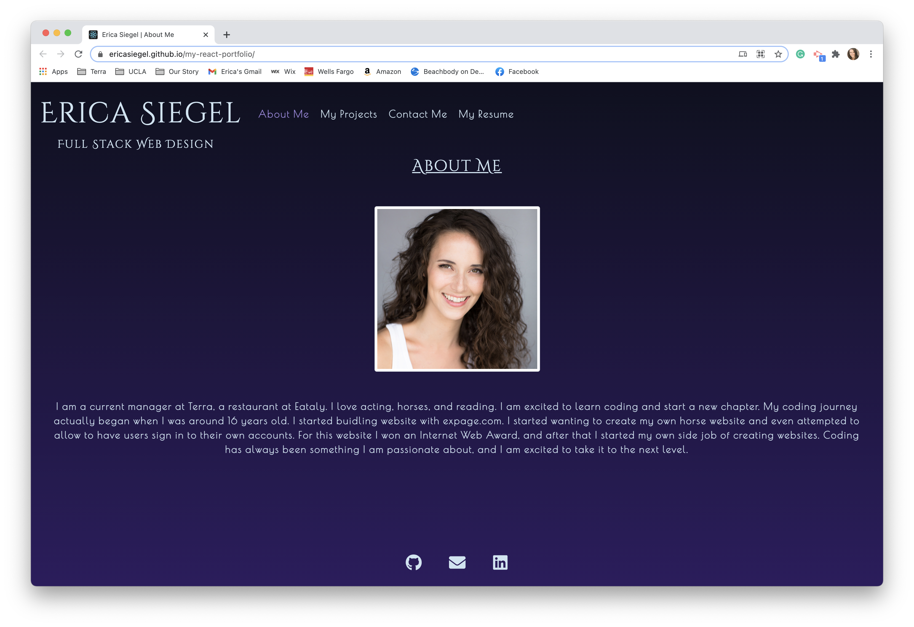
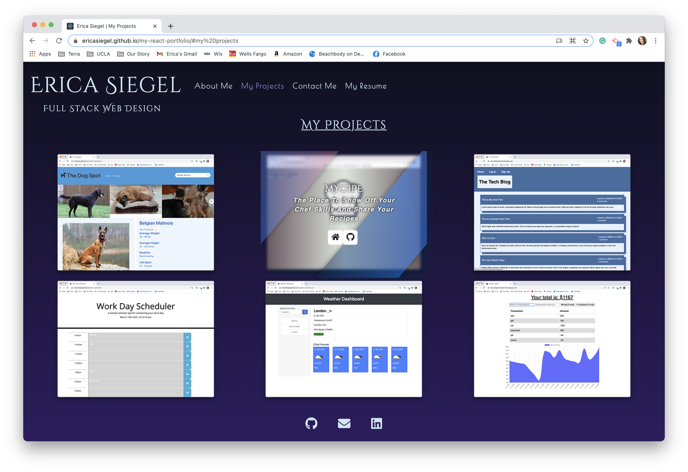
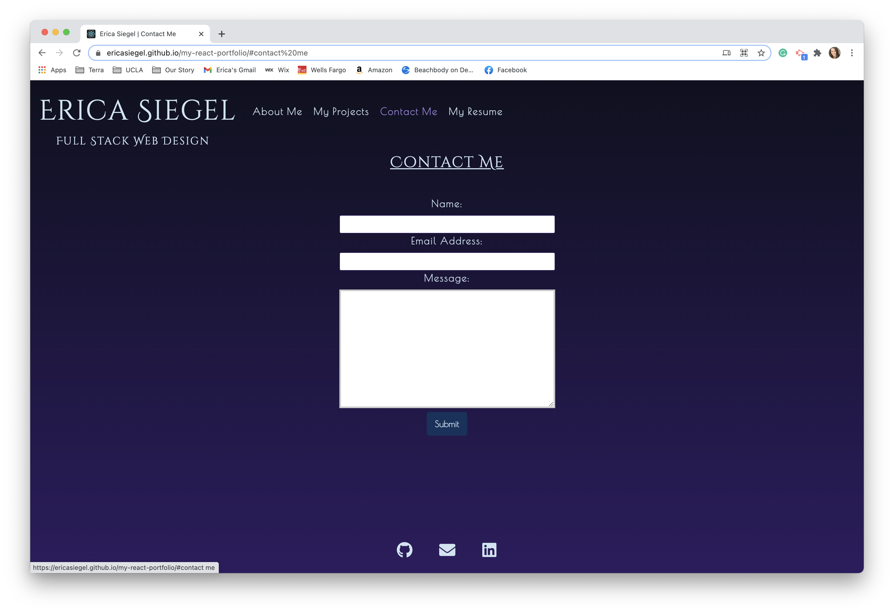
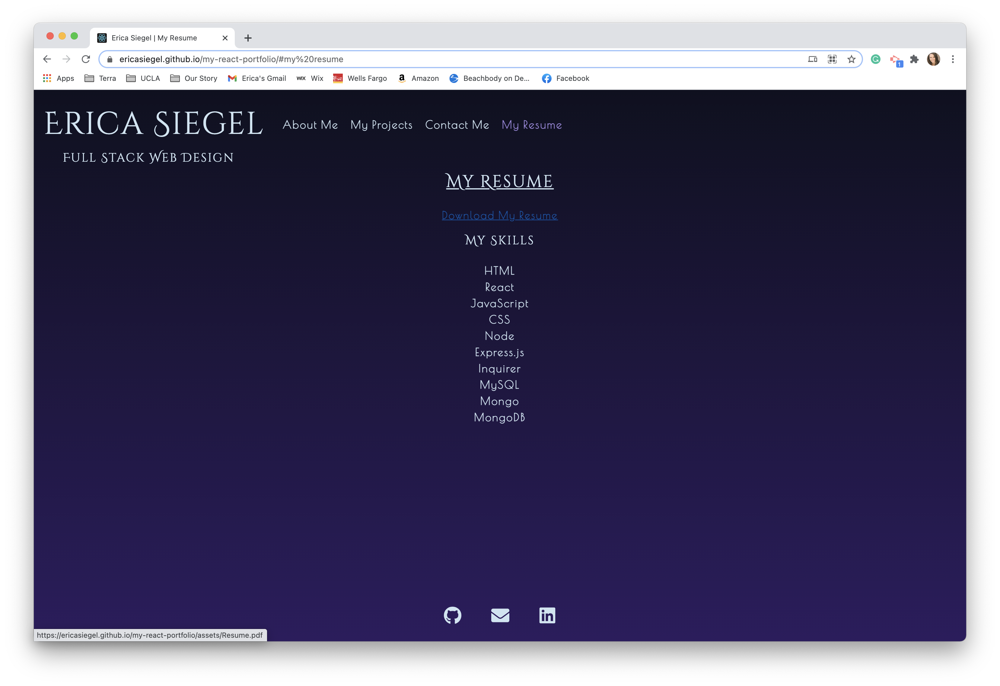

# Erica's React Portfolio 
  

 
## Description
Using the React Template package I created a front end portfolio website showcasing my projects and skills. This project is also designed to showcase my react skills and use of new technologies. 

## Table of Contents
  
* [Description](#description)
* [Features](#features)
* [Languages](#languages)
* [Links](#link)
* [Usage](#usage)
* [Screenshots](#screenshots)
* [License](#license)

## Features
    
- About Me Section
- Projects with hover animation
- Contact form
- View my Skills and Download my Resume

## Languages

JavaScript, HTML, CSS, Node, React, JSX

## Link 

[My React Portfolio Deployed Page](https://ericasiegel.github.io/my-react-portfolio/#my%20projects)

[My React Portfolio GitHub](https://github.com/ericasiegel/my-react-portfolio.git)

## Usage

With my React Portfolio you can learn about me, view my projects, contact me, and view my skills and resume.

## Screenshots
    
### Main Page / About Page

### Projects Page

### Contact Page

### Resume Page

## Credits

- [Node.js](https://nodejs.org/en/)
- [React](https://reactjs.org/)
- [BestjQuery hover effects](https://www.bestjquery.com/lab/hover-effects/)
- [React Icons](https://react-icons.github.io/react-icons)
    

## License

This project is covered under MIT License

